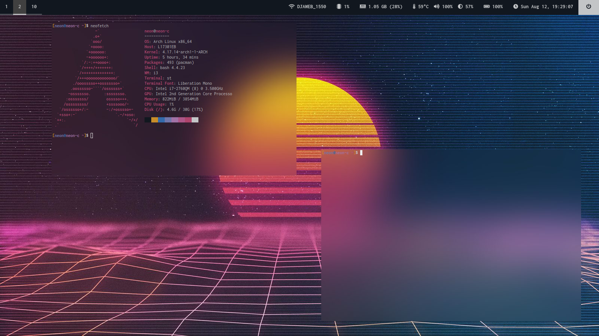

# Change Theme


This is a script that, given a path to an image file, will set the wallpaper, st image background and, using Pywal, update the system colors based on the image's colors.

This script also processes the image, using ImageMagick, to add a blur or frosted glass effect. This gives you the ability to have very heavy blur effects in st, without pushing your computer to the limit with real time blurring.

# Requirements

## Basic

- Pywal

- awk

- ImageMagick

- Colorz (Optional)

- Colorthief (Optional)

- Haishoku (Optional)

- Schemer2 (Optional)

## Suckless Terminal Image Background


These are optional, and only necessary if you want st to update it's background image.

- [ST Image Background Patch](https://github.com/hexoctal/st-image-background)

- [ST Background Event Emitter](https://github.com/hexoctal/st-bg-event)

# Usage



You can launch the script using the `-h` flag to show all the available flags, which are also detailed below.

## Flags

- `-h`: Shows a help message that displays the available flags as well as the available Pywal backends (Which need to have been installed first).

- `-i path/to/image`: The image to use as a wallpaper, st background and source to set the system colors from.

- `-b backend`: The backend to use for Pywal. More details about this below.

- `-D density`: A value used for the displacing of the image for the frosted glass effect.

- `-S spread`: The spread of the frost effect. A higher value makes the images crisper, more "pixely" and so blurrier.

- `-B bluramt`: The amount of blurring of the image in pixels __before__ applying the dispersion.

- `-O opacity`: The opacity of the color above the image. An opacity of `0` will display the image as is (blurred and frosted). An opacity of `100` will show a solid background color, hiding the image completely. An opacity of `50` will show the image overlaid with a solid color.

## Backends

This script works with all the backends supported by Pywal.

- `-b 1` or `-b a` of `-b wal`: [Wal](https://github.com/dylanaraps/pywal) (Pywal's default backend).

- `-b 2` or `-b b` of `-b colorz`: [Colorz](https://github.com/metakirby5/colorz).

- `-b 3` or `-b c` of `-b colorthief`: [Colorthief](https://lokeshdhakar.com/projects/color-thief/).

- `-b 4` or `-b d` of `-b haishoku`: [Haishoku](https://github.com/LanceGin/haishoku).

- `-b 5` or `-b e` of `-b schemer2`: [Schemer2](https://github.com/thefryscorer/schemer2).

Note that in order to use a given backend, you first need to install it. Check the desired backend details for how to do that in your system.

# Details


When this script is launched, it first prepares the given image by resizing it to your screen size. Then it applies a blur effect, generates a noise texture and use it to displace the blurred image.

If you only wish to blur the image without the frost effect, run the script with the flag `-S 0`.

After working on the image, the script will call Pywal, using the previously selected backend, or the defaul one if none has been given.

It them overlays the background color on the image using the chosen opacity, or 50% if none has been provided.

Four (4) images are produced from running this script, all of them are stored in `$HOME/.config/` and automatically replaced when the script is ran again:

- `wall`: The resized image, used as a wallpaper.

- `wall0`: The blurred, frosted and overlayed image. Used by st when patched with [background image support](https://github.com/hexoctal/st-image-background).

- `wall1.png`: Blurred image with no overlay or frosted effect.

- `wall2.png`: Blurred and frosted image with no overlay.

## :warning: Warning :warning:

This script isn't tested with a multi-screen setup. It might just work, or not...

## :cyclone: Bspwm :cyclone:

If you use Bspwm as a tiling manager, you probably want to uncomment the 2 following lines near the end of the script:

```shell
## Uncomment the following two lines to refresh the bspwm tiling manager
#echo "Updating Bspwm"
#bspc wm -r
```

This will restart bspwm to update its colors. This will not close the applications currently running, just update colors!

## Automatically update st instances 

If you use this [st patch](https://github.com/hexoctal/st-image-background), uncomment the last two lines of the script:

```shell
## Uncomment the following two lines to update running st instances
echo "Updating already running instances of st (Xlib XSendEvent)"
st-bg-event
```

This will update all running instances of st, effectively changing their image background to the new one. Without this, only st windows opened after setting the new image will use it, and already opened st windows will still display the old image.

This is still needed even if you reuse the same image but only change effect settings like blurring or opacity.

Note that this uses this [program](https://github.com/hexoctal/st-bg-event) to update st. So it needs to be in your system `PATH`.


# Credits

The frosted effect is taken from Fred Weinhaus' website: [http://www.fmwconcepts.com/imagemagick/frosted/index.php](http://www.fmwconcepts.com/imagemagick/frosted/index.php).
